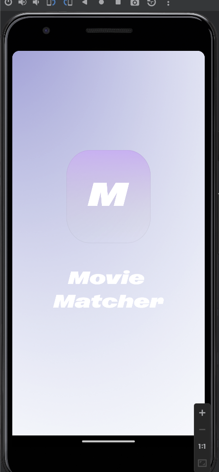
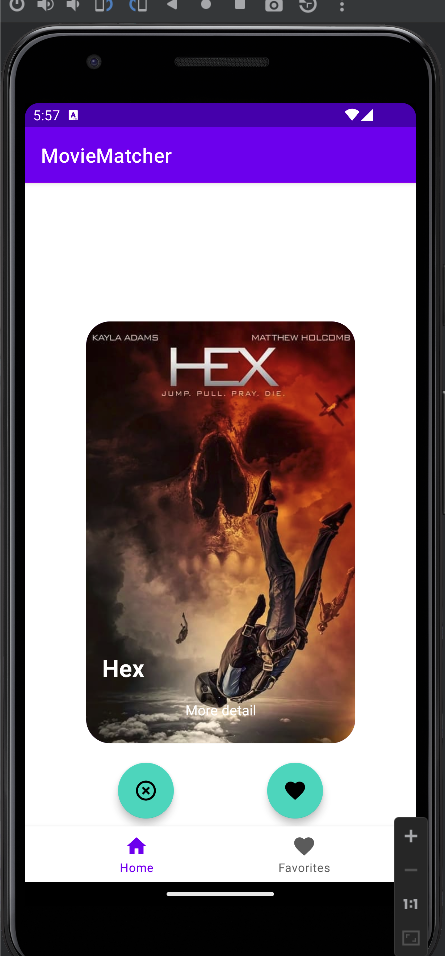
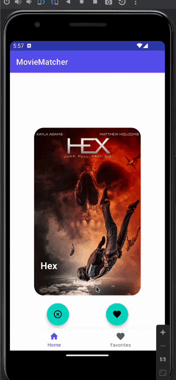
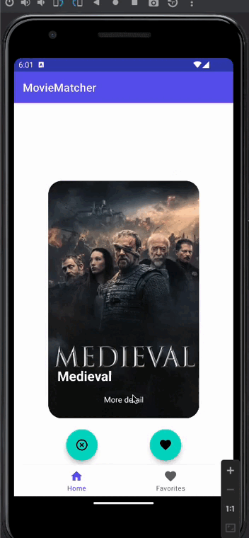
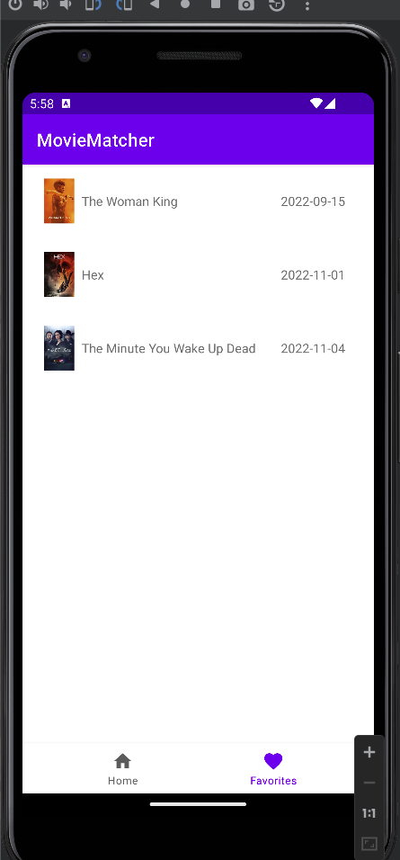

# MovieMatcher
Application mobile Android développée lors de notre module de M2 Ynov développement mobile natif.

## Groupe
Mastère 2 : Sascha salles / Théo Delas

## L'application
Petite application mobile android permettant à l'utilisateur de choisir ses films favoris via un système de swipe.  
L'utilisateur se voit présenté une pile de films récupérer aléatoirement parmi les films les plus populaire grâce à l'API TheMovieDatabase.  

## Features
- Splashscreen
- Une navbar qui contrôle 2 fragments. Le premier étant la vue principale avec la pile à swipe et la deuxième étant l'écran des films favoris
- Un système de swipe complet
- Chaque film liké est automatiquement ajouté à la liste des favoris
- Singleton
- Call API TheMovieDatabase

## Technologies
- Kotlin
- Architecture MVVM
- Coil pour les images
- Plusieurs flows d'asynchrone : observer pattern & kotlin co-routines
- Listeners

## Screens
### SplashScreen  

### Home Screen  
  
  
  

### Favorites Screen  

